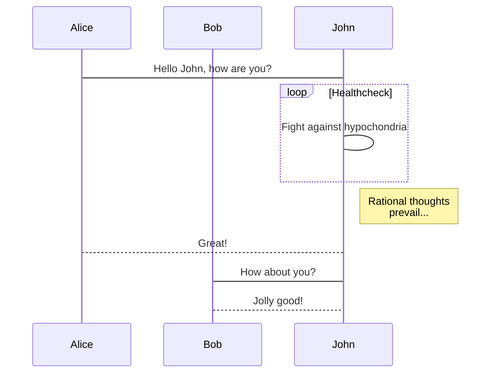
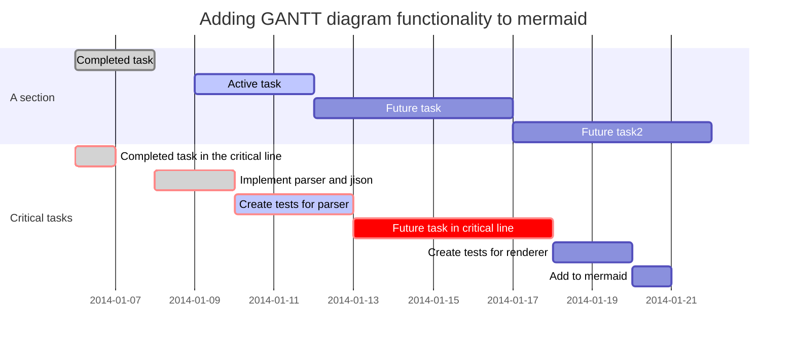
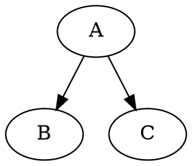

```flow
st=>start: 鉴权
e=>end: 结束退出
cond1=>condition: user==bgbiao
product=ddaotian
productcheck=>condition: ddaotian类型产品库存
(ecs,bss,vpc,eip,hids)
  
  
op1=>operation: 发起预订请求
拆单并库存检测
  
op2=>operation: info:生产指定类型产品
(DAOTIAN:ecs,natip,eip,hids)
op3=>operation: 鉴权失败
op4=>operation: 库存检测失败
  
io1=>inputoutput: 返回产品相关信息
ECS,NATIP,EIP,HIDS
  
io2=>inputoutput: info:无此类型产品
  
st->cond1
cond1(yes)->op1->productcheck(yes)->op2->io1->e
cond1(no)->op3->e
cond1(yes)->op1->productcheck(no)->op4->io2->e

```

```squence
bgbiao-> bianbian: good morning
note left of bgbiao: man
bianbian -> bgbiao: eat something
note right of bianbian: woman
  
note over bgbiao: test

```









